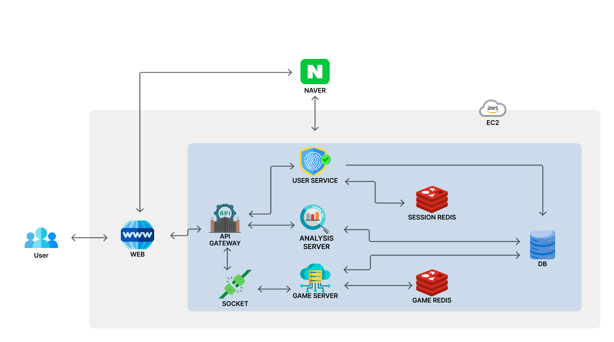
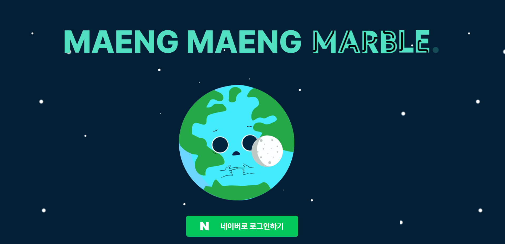
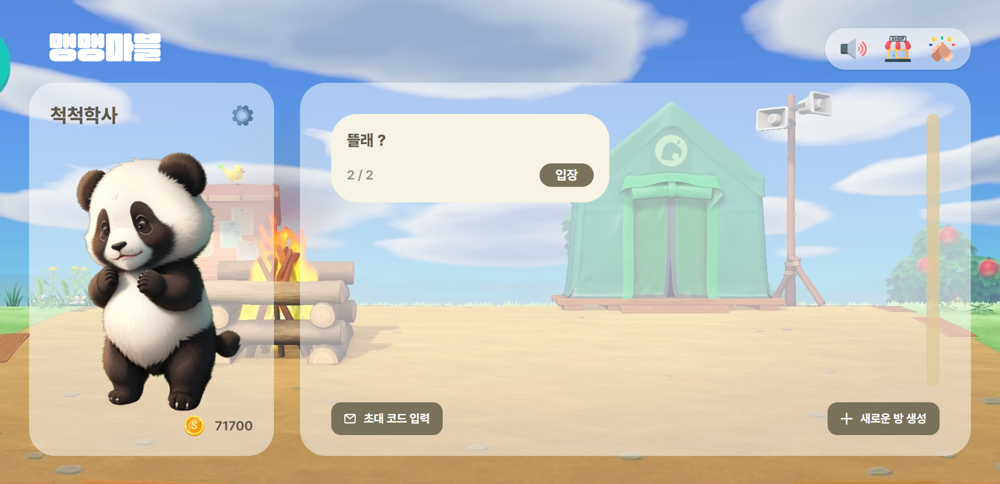
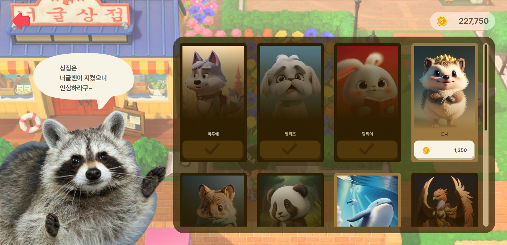
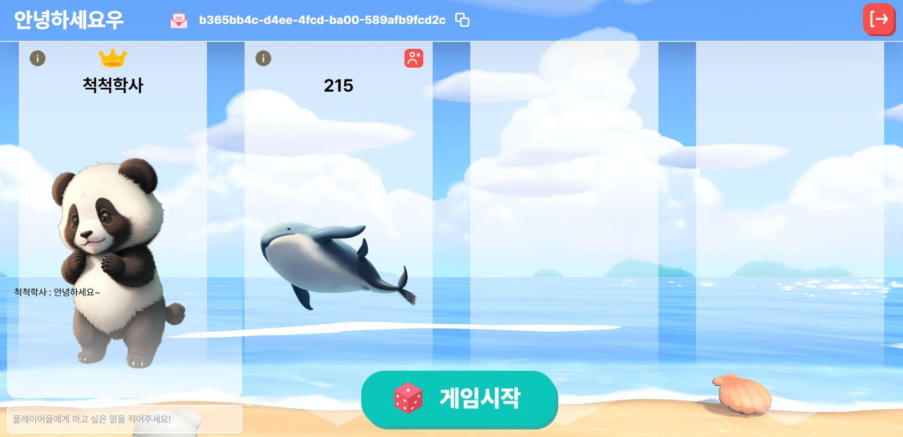
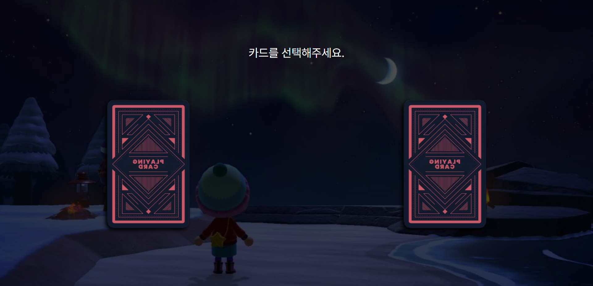
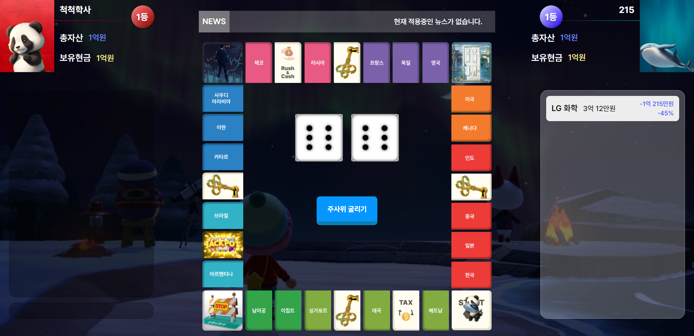

## D207

   
   
   

## 🙇🏻팀명 : 은하와 시치들
  
   
   
   
  
  
## 💡 주제
 __핀테크__
  
   
   
   
  
  
## 👥 프로젝트 한 줄 설명
금융 문맹을 탈출하기 위한 온라인 지역과 화폐의 가치가 실시간으로 변동하는 부루마블 게임
  
   
   
   
  
  
## 🧑🏻‍🦯 프로젝트 목적
"문맹은 생활을 불편하게 하지만, ‘금융 문맹’은 생존을 불가능하게 만들기 때문에 문맹보다 더 무섭다."
미국 경제학자이자 연방준비제도이사회 의장이었던 앨런 그린스펀이 한 말입니다. 
금융 문맹이란 돈을 어떻게 관리해야 할지 모르는 것을 뜻합니다.

우리나라 청소년의 금융 이해력 수준이 계속 낮아지고 있습니다. 청소년금융교육협의회(청교협)의 ‘청소년 금융이해력조사 결과’ 발표에 따르면, 2023년 우리나라 학생들의 금융 이해력 평균 점수는 
낙제 점수 60점에 한참 못 미치는 수준인 46.8점으로 나타났습니다.

이러한 금융 문맹을 해결하기 위해 맹맹마블(Money Management Game)을 기획하게 되었습니다.
 
 
   
   
 
## 🛠 기술 스택
`공통` - OAuth 2.0

`Front` - React, TypeScript, React-Query, tailwind, npm, Recoil, vite

`Back` - Java, Springboot, Spring Security, Swagger, JUnit, Gradle, Python

`DB` - MySQL

`채팅` - Socket.io, Redis

`Deploy` - AWS EC2, RDS, S3, Nginx, Jenkins, Docker

`Cooperation` - Figma, Jira, GitLab, Mattermost, Notion 
 

   
   
 
## 🔌 아키텍처

맹맹마블의 서비스 아키텍쳐 구성도입니다.

네이버 소셜 로그인으로 로그인 기능을 구현하였습니다.

유저에게 게임 커뮤니티 기능을 제공하는 user service,
게임 로직을 처리하는 game server,
유저의 게임 플레이 데이터를 분석하여 플레이 스타일을 제공할 analysis server,
총 3개의 서버로 나누었고,
이 서버들의 앞단에 api gateway 서버를 두어 적절한 서비스에 라우팅 하게 하였습니다.

game server는 유저들에게 실시간성 보장과, 데이터 전달을 위해 stomp 프로토콜을 이용한 socket 통신으로 구현할 것입니다.

또한 유저에게 발급 된 token을 저장하는 session redis와,
실시간으로 변화하는 게임 데이터를 저장할 cache redis
총 두 개의 redis 서버를 두었습니다.

그리고 게임 플레이 데이터와, 유저별 게임 플레이 스타일을 분석한 정보는 RDBMS에 저장 됩니다.

   
   
  
## 🔌 맹맹마블 기능
#### 네이버 소셜 로그인 지원

 
 
#### 로비에서 대기방 입장 및 생성

 
 
#### 여러가지 캐릭터 구매

 
 
#### 채팅이 가능한 대기방

 
 
#### 랜덤으로 정해지는 순서

 
 
#### 신나는 게임 화면

   
   
  
### 아이디어 차별성
게임을 진행하며, 대출/주식/이자 등에 대한 경제 개념에 자연스럽게 스며들 수 있습니다.
기존 부루마블과는 차별화된 웹 게임으로 부동산과 화폐의 가치가 실시간으로 변동합니다.
주식 매수 매도 시스템을 게임에 적용하였습니다.
기존의 게임에서는 부동산이 주된 수익구조 였다면 맹맹마블에서는 부동산 이외에도 주식을 추가해 수익 창출 구조를 다변화하였습니다.
게임 중 나오는 뉴스 카드 내용이 부동산, 주식에 실시간으로 영향을 주어 더 현실성 있는 게임을 진행할 수 있습니다.
기존의 게임은 전략보다 운이 게임의 승패를 가릅니다.
맹맹마블은 주식 및 뉴스카드 기능을 이용하여 보다 전략적이고 경제 시스템을 잘 파악한 유저가 승리할 수 있도록 구성하였습니다.

   
   

### 고도화 방안
게임을 플레이하면서 나온 다양한 데이터들을 활용하여 유저들의 플레이 스타일을 분석할 예정입니다.
게임 플레이 데이터에는 (위에서부터) 통행료로 얻은 수익, 빠친코 수익률, 주식 투자 수익률 등이 있고,
이를 데이터 분석 서버로 보내어 유저별 플레이 스타일을 시각화해 제공할 계획입니다.
플레이 스타일을 기반으로 다양한 금융상품을 추천하여 금융 상품에 대한 전반적인 지식을 얻을 기회를 제공할 계획입니다.
이 그래프와 같이 주식 투자를 공격적으로 하여 수익을 얻는 플레이어라면, 가격이 다소 급격하게 변화하는 IT 관련 펀드를 추천해 주고,
안정적으로 게임 머니를 운용하는  플레이어에게는 정기 예금 상품을 추천할 것입니다.
참고로 이 금융 상품들은 실제 운용 되는 금융 상품들로 구성될 예정입니다.

   
   
   

## 📒 관련 자료
[노션](https://desert-package-890.notion.site/16d80aa9c53f4b99bf9c620c513a1892?pvs=4)  
[Figma](https://www.figma.com/file/nooFy2VIyM5B3Qw8w3npG4/%EA%B0%80%EC%A0%9C?type=design&node-id=0%3A1&mode=design&t=pslKRrAeGQJbMAvW-1)

   
   
   

## 👩‍👩‍👧‍👧 팀원
SSAFY 9기
| 강준구 | 권민재 | 김상근 | 김은하 | 이일호 | 이효진 |
| ------ | ------ |----|-----|----|-----|
|  |  |||||
| BackEnd | BackEnd | FrontEnd | FrontEnd | BackEnd | BackEnd |
