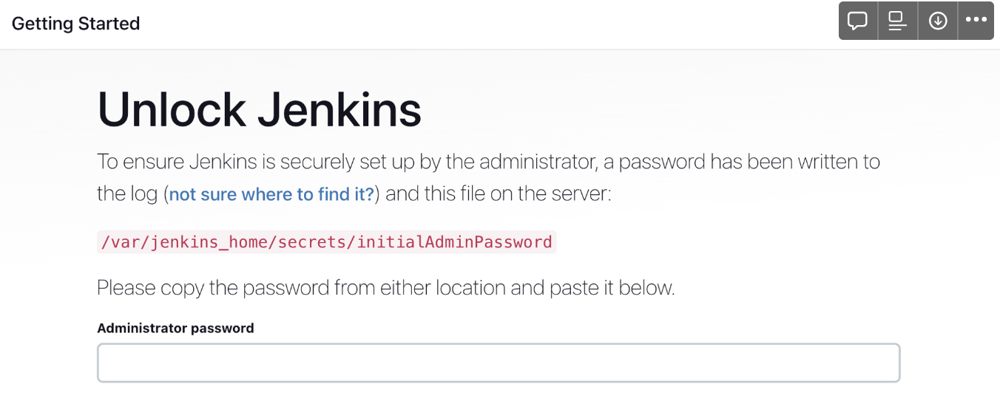
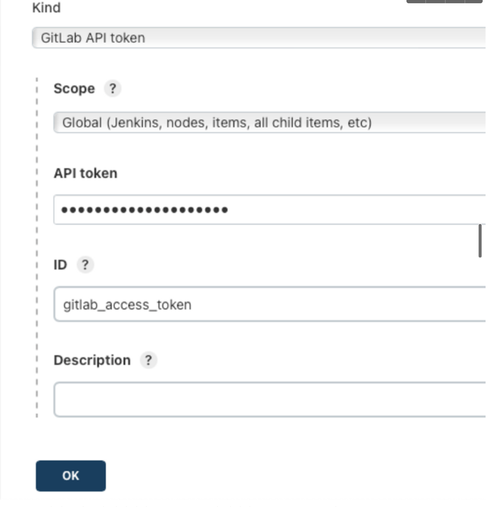
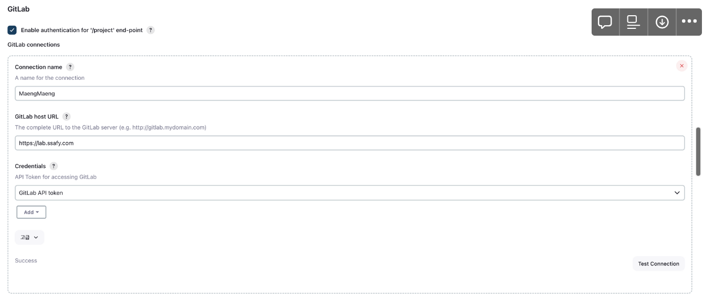
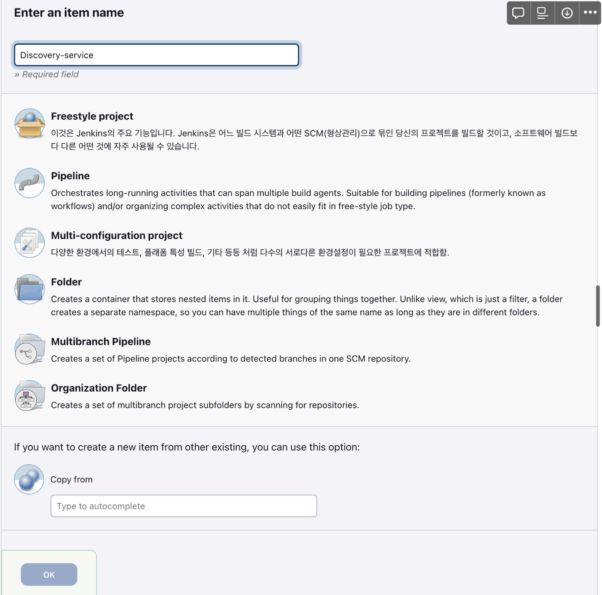
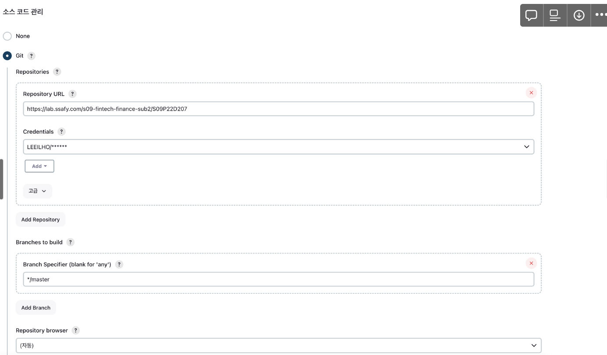
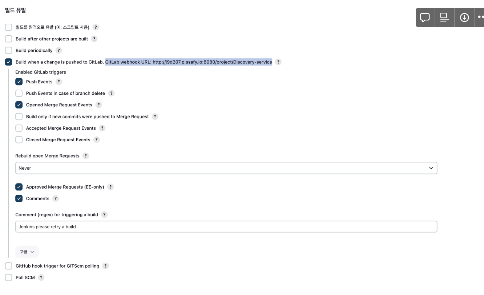
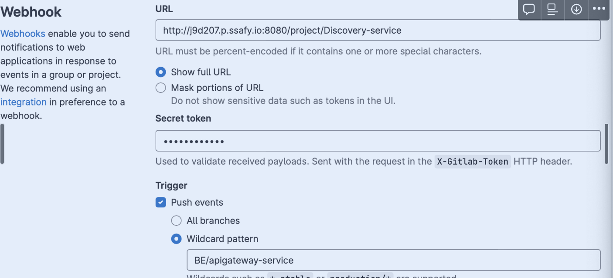
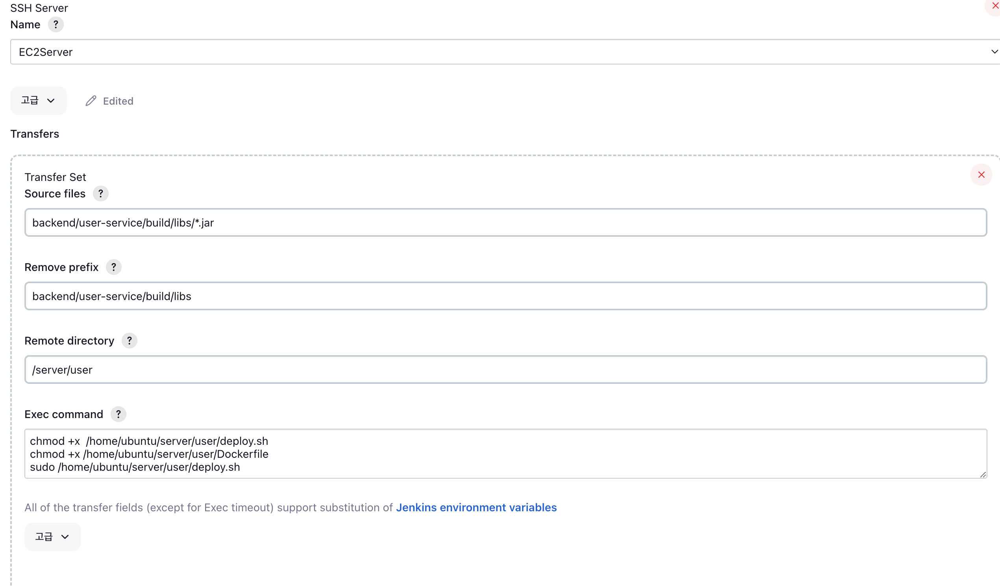

# 빌드 및 배포 문서

## 1. 프로젝트 사용도구

- 이슈관리: JIRA
- 형상 관리: GITLAB
- 커뮤니케이션: Notion, MatterMost
- 디자인: figma
- UCC: 모바비
- CI/CD : JENKINS ,Docker 

## 2. 개발 환경

### FRONT
---
- React : 18.2.0
- react-router-dom :  6.14.1
- TypeScript :  4.4.2
- React-Query : 3.39.3
- Axios : 1.4.0
- Redux : 4.2.1
- Emotion : 11.0.0
- yarn : 1.22.19
- node.js : v18.16.1
- chart.js :  4.3.0
### BackEnd
---
- InteliJ
- SpringBoot: 2.7.15
- gradle: 8.1.1
- JAVA: 11.0.18
- MYSQL: 8.0.34
- REDIS: 7.0.12
- NGINX: 1.8.0


## 3. 환경 변수 

### Application.properties
```properties
     
  # Token Setting
app.auth.access-expiry=1800000
app.auth.refresh-expiry=604800000

#Local MySQL Setting
server.port=8080
spring.datasource.driver-class-name=com.mysql.cj.jdbc.Driver
spring.datasource.url=jdbc:mysql://j9d207.p.ssafy.io:3306/maengmaeng?useSSL=false&characterEncoding=UTF-8&serverTimezone=UTC
spring.datasource.username=root
spring.datasource.password=maengmaeng

#JWT Setting
jwt.secret-key=rkdwnsrnrlatkdrmsrladmsgkrnjsalswodldlfghdlgywls207xladkwkdkwkghkdlxldekemfwkfajrrhwkftkfwk

# OAuth Setting
spring.security.oauth2.client.registration.naver.client-id=Kecej_d0LIleRy3N3wSL
spring.security.oauth2.client.registration.naver.client-secret=m1_vu_LFtd
spring.security.oauth2.client.registration.naver.authorization-grant-type=authorization_code
spring.security.oauth2.client.registration.naver.scope=name,email,profile_image
spring.security.oauth2.client.registration.naver.client-name=naver
spring.security.oauth2.client.registration.naver.redirect-uri=http://j9d207.p.ssafy.io¸:3000/login/oauth/naver/callback

# Naver OAuth2 ????? ??? Provider ??
spring.security.oauth2.client.provider.naver.authorization-uri=https://nid.naver.com/oauth2.0/authorize
spring.security.oauth2.client.provider.naver.token-uri=https://nid.naver.com/oauth2.0/token
spring.security.oauth2.client.provider.naver.user-info-uri=https://openapi.naver.com/v1/nid/me
spring.security.oauth2.client.provider.naver.user-name-attribute=response

#Naver OAuth Request URL
naver.accesstoken-url = https://nid.naver.com/oauth2.0/token
naver.userinfo-url = https://openapi.naver.com/v1/nid/me

#Redis Setting
# Redis Server
spring.redis.host=j9d207.p.ssafy.io
spring.redis.port=6379

#Local Redis Setting
# spring.devtools.livereload.enabled=true
spring.devtools.livereload.enabled=true

# spring.devtools.restart.enabled=false
spring.devtools.restart.enabled=false

# spring.freemarker.cache=false
spring.freemarker.cache=false   

```

## 4 배포 과정

1. EC2 서버에 docker 설치
  ```bash
# Add Docker's official GPG key:
sudo apt-get update
sudo apt-get install ca-certificates curl gnupg
sudo install -m 0755 -d /etc/apt/keyrings
curl -fsSL https://download.docker.com/linux/ubuntu/gpg | sudo gpg --dearmor -o /etc/apt/keyrings/docker.gpg
sudo chmod a+r /etc/apt/keyrings/docker.gpg

# Add the repository to Apt sources:
echo \
  "deb [arch="$(dpkg --print-architecture)" signed-by=/etc/apt/keyrings/docker.gpg] https://download.docker.com/linux/ubuntu \
  "$(. /etc/os-release && echo "$VERSION_CODENAME")" stable" | \
  sudo tee /etc/apt/sources.list.d/docker.list > /dev/null
sudo apt-get update
sudo apt-get install docker-ce docker-ce-cli containerd.io docker-buildx-plugin docker-compose-plugin
  ```

2. DOCKER에  JENKINS 설치
```bash
docker run -itd --name jenkins -p 8080:8080 jenkins/jenkins:lts-jdk11
ubuntu@ip-172-26-14-45:~$ sudo docker exec -it jenkins /bin/bash
jenkins@e01a90cbc64f:/$ cat /var/jenkins_home/secrets/initialAdminPassword
038d23ee2f3146c1947949bd74311acf
```
    - j9d207.p.ssafy.io:8080 접속
    - 
```bash
ubuntu@ip-172-26-1-179:~$ sudo docker exec -it jenkins  /bin/bash
root@a1379bc5ef0c:/# cat /var/jenkins_home/secrets/initialAdminPassword
01ef6c7d5fb847ebb20256ac02ebd4ef
#제일 밑의 키 입력
```
  d. install suggested plugins
  e. gitlab, publish over ssh 플러그인 설치
  f. 웹브라우저 접속, 초기 비밀번호 확인 후 접속시 나타나는 창에 입력
  ```bash
      docker exec jenkins cat /var/jenkins_home/secrets/initialAdminPassword 
  ```

3. Gitlab Credentials 추가
    - JENKINS 관리 -  managecrendentials로 이동
    - 
4. JENKINS 관리 - 시스템 설정에서 GitLab 부분에 생성한 Credentials 추가
    - 
5. ITEM 생성
    - 
6. GITLAB 저장소와 연결
    - 
7. JENKINS 설정
    - 
8. GITLAP WEBHOOK 설정
    - 
9. BUILD
    - cd /var/jenkins_home/workspace/User-service/backend/user-service
    - mkdir -p src/main/resources
    - chmod +x gradlew
    - ./gradlew clean build
10. Publish Over ssh
    -  
11. DockerFile
```bash
FROM openjdk:11
ARG JAR_FILE=*.jar
COPY ${JAR_FILE} user-service-0.0.1-SNAPSHOT.jar
ENTRYPOINT ["java", "-jar","/user-service-0.0.1-SNAPSHOT.jar"]    
```
12. Deploy.sh
```bash
#!/bin/bash
echo "> User  Server"

IMAGE_NAME=user
IDLE_PROFILE=user
IDLE_PORT=9000
TAG_ID=$(docker images | sort -r -k2 -h | grep "${IMAGE_NAME}" | awk 'BEGIN{tag = 1} NR==1{tag += $2} END{print tag}')
sudo docker stop user
sudo docker rm user

echo "> 도커 build 실행 : docker build --build-arg -t ${IMAGE_NAME}:${TAG_ID} ."
sudo docker build -t ${IMAGE_NAME}:${TAG_ID} /home/ubuntu/server/user

echo "> set1 배포"
echo "> 도커 run 실행 :  sudo docker run --name $IDLE_PROFILE -d --rm -p $IDLE_PORT:9000 ${IMAGE_NAME}:${TAG_ID}"
sudo docker run --name user -d --rm -p $IDLE_PORT:${IDLE_PORT} ${IMAGE_NAME}:${TAG_ID}
~
```

